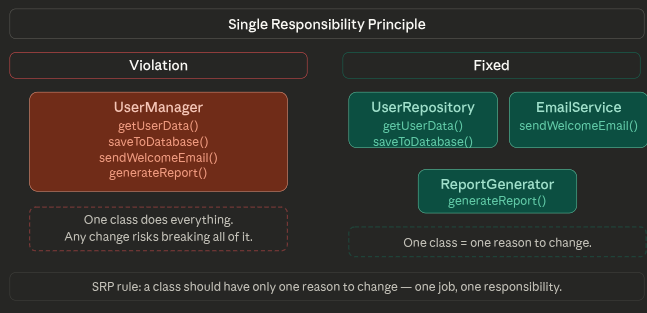
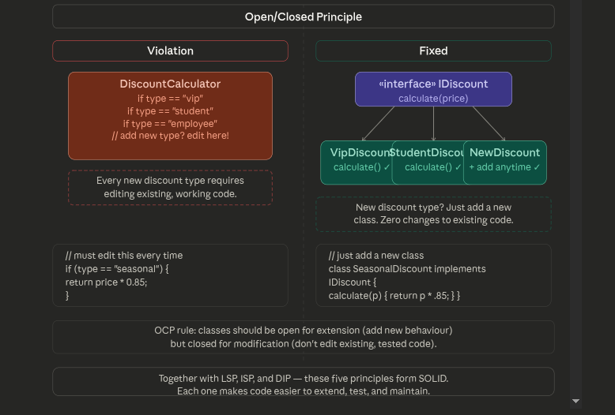
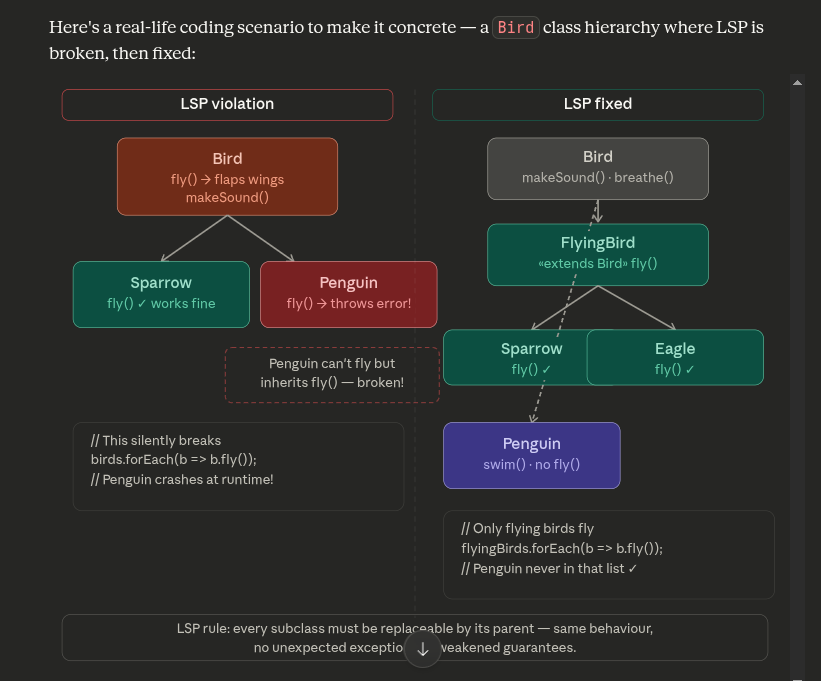
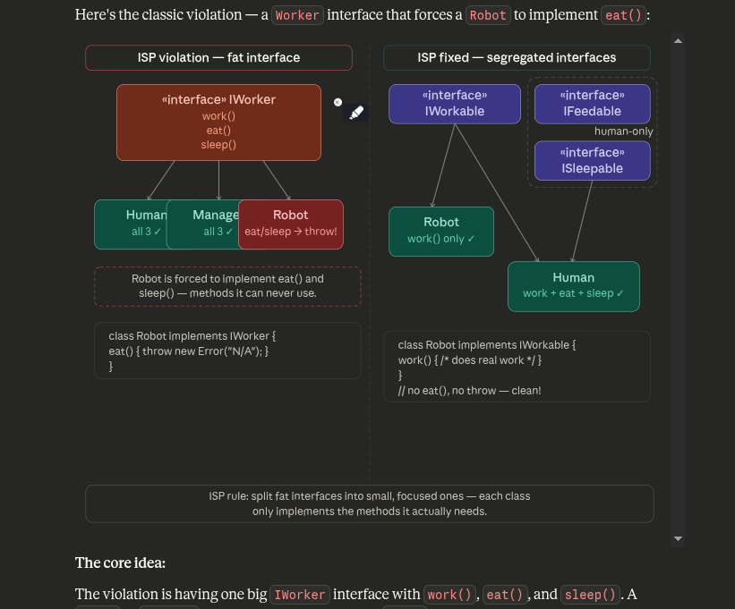
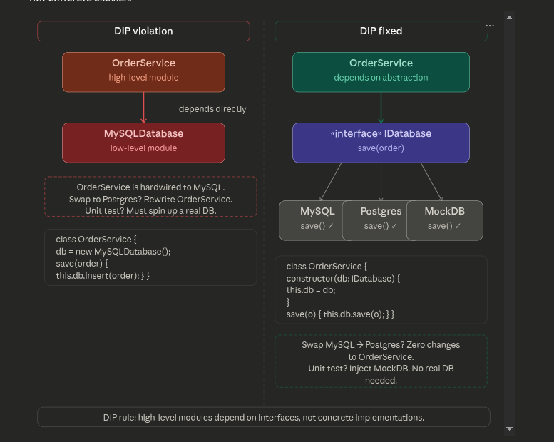

# Solid Prin
ciples

## Single Responsibility Principle (SRP)
Each class should have only one responsibility. This makes code easier to maintain and understand.

## Open/Closed Principle (OCP)
Software entities should be open for extension but closed for modification. This allows you to add new features without changing existing code.

## Liskov Substitution Principle (LSP)
Objects of a superclass should be replaceable with objects of a subclass without affecting the correctness of the program.

## Interface Segregation Principle (ISP)
Clients should not be forced to depend on interfaces they do not use. Split large interfaces into smaller, more specific ones.

## Dependency Inversion Principle (DIP)
High-level modules should not depend on low-level modules. Both should depend on abstractions.

